# Metni Düzenle v1.3

**Metni Düzenle**, PDF dosyalarından, web sayfalarından veya çeşitli belgelerden kopyalanan metinlerdeki bozuk satır ve paragraf yapılarını otomatik olarak düzenleyen ve Word, Not Defteri, çeviri uygulamalarına, ..vb yapıştırmaya hazır hale getiren, python programlama dili ile yazılmış masaüstü uygulamasıdır.

Kopyalanan metinlerin satır aralıklarındaki kopuklukları, hece bölmelerini (tireleri) ve gereksiz satır atlamalarını temizleyerek metnin cümle ve paragraf bütünlüğünü geri kazandırır.

## 🚀 Öne Çıkan Özellikler

### 1. Akıllı Metin Onarımı ve Düzeltme

- **Kopuk Satırları Birleştirme:** Parçalanmış cümleleri algılar ve satır sonlarındaki hecelemeleri/kısa satırları tek bir düzgün paragraf haline getirir.
- **Otomatik Sayfa Numarası Temizleme:** PDF ve belgelerden kopyalanan "Sayfa 12", "Page 15" vb. istenmeyen numara/bilgileri ayıklar.
- **Türkçe Karakter Düzeltici:** `Ý`, `ý`, `Þ`, `þ`, `Ð`, `ð` gibi belge dönüştürücülerinde sıkça karşılaşılan bozuk Türkçe karakterleri tespit edip orijinal hallerine (`İ`, `ı`, `Ş`, `ş`, `Ğ`, `ğ`) çevirir.

### 2. Gelişmiş Karakter Manipülasyonu

Araç, metni düzeltmekle kalmaz, aynı zamanda sağ paneldeki **Karakter Manipülasyonu** bölümündeki pratik radyo butonları aracılığıyla metin üzerinde anında format dönüştürmeleri yapmanıza olanak tanır:

- **Orijinal:** Metnin ilk kopyalanmış haline anında geri dönüş.
- **BÜYÜK HARF:** Tüm harfleri büyütür. (Türkçe `i/İ` karakter duyarlılığıyla).
- **küçük harf:** Tüm harfleri küçültür.
- **İlk Harfler Büyük:** Her kelimenin ilk harfini büyük yapar.
- **Cümlelerin İlk Harfleri Büyük:** Nokta, ünlem ve soru işaretlerinden sonra başlayan her yeni cümlenin ilk harfini büyük yapar.

### 3. Kullanıcı Dostu Modern Arayüz ve Ayarlar

- **Karanlık Mod (Dark Mode):** Göz yormayan ve modern bir tasarım seçeneği (Ayarlar altından açılıp kapatılabilir).
- **Her Zaman Üstte Tut:** Uygulamanın diğer pencerelerin arkasında kaybolmasını önler.
- **Global Kısayol Tuşu:** Uygulama arka plandayken bile belirlediğiniz (Örn: `Ctrl+Shift+E`) bir kısayol kombinasyonuyla metinleri kopyaladığınız an otomatik düzenleyip panoya alabilirsiniz.

### 4. Kalıcı Geçmiş Yönetimi

- **Kalıcı Kayıt (`gecmis.json`):** Düzenlediğiniz geçmiş metinler uygulamanın kök dizininde otomatik olarak saklanır. Uygulamayı kapatsanız dahi geçmişe erişebilirsiniz.
- **Seçileni / Tümünü Sil:** Geçmiş listenizi pratik butonlarla yönetebilir, tek bir tıkla istediğiniz kayıtları veya tüm geçmişi silebilirsiniz.

## 🛠️ Kurulum Gereksinimleri

Programın kaynak kodu olarak çalıştırılabilmesi için Python 3 ve gerekli kütüphanelerin yüklü olması gerekir.

### Gerekli Kütüphaneler:

- **PySide6** (Arayüz tasarımı için)
- **keyboard** (Kısayol tuşlarını dinleyebilmek için)

```bash
pip install PySide6 keyboard
```

> **Not:** `keyboard` modülünün sorunsuz çalışabilmesi için işletim sisteminize bağlı olarak uygulamanın **yönetici/root** yetkileriyle çalıştırılması gerekebilir.

## 📖 Kullanım Rehberi

1. Herhangi bir PDF veya web sayfasındaki bozuk metni kopyalayın (`Ctrl+C`).
2. Uygulama arayüzündeki **"Kopyalanmış Metni Düzenle ve Panoya Kopyala"** butonuna basın veya klavyenizden **Global Kısayol Tuşu'nu** (varsayılan: `Ctrl+Shift+E`) kullanın.
3. Uygulama arayüzünde onarılmış metni görebilirsiniz ve metin otomatik olarak panonuza (Clipboard) kopyalanmış olacaktır.
4. Düzenlenmiş bu düzgün metni istediğiniz Word, Excel, Not Defteri veya web formuna yapıştırabilirsiniz (`Ctrl+V`).

### Ayarlar Paneli

Uygulamanın sağ tarafında her zaman erişilebilir olan ayarlar menüsü üzerinden:

- Kısayol tuşunuzu değiştirebilir,
- Karanlık modu aktif edebilir,
- Otomatik sayfa temizlemeyi ve Türkçe karakter düzeltmesini kendi senaryonuza göre kapatıp açabilirsiniz. 

Her yapılan değişiklik otomatik olarak `ayarlar.json` dosyasına kaydedilerek bir sonraki kullanım için hazır tutulur.

## 🎨 Uygulama Ekran Görüntüleri

Örnek PDF dosyamız ve kopyalayacağımız sayfa / metin.


Kopyalanan metin, not defterine yapıştırıldığında aşağıdaki sonuç elde ediliyor. PDF dosyasını her satır, ayrı yapı olarak algılanıyor. Bu halde, cümle ve paragraf yapısı bozulmuş oluyor.  


Uygulamanın ilk çalıştırılması ile karşılaşılan temiz, anlaşılır ve radyo (radio) butonlarıyla güncellenmiş masaüstü görünümü;

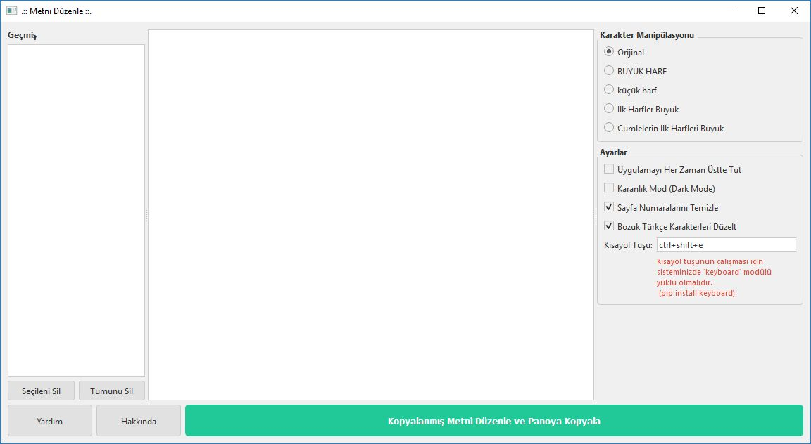

**Kopyalanmış Metni Düzenle ve Panoya Kopyala** butonuna basılınca veya önceden belirlediğiniz **Kısayol Tuşuna** (`Ctrl+Shift+E` vb.) basıldığında, kopyalanmış olan metin, kaynak metnin cümle ve paragraf yapısına uygun olacak şekilde düzenleniyor ve uygulama içerisinde görüntüleniyor.

Kopyalanıp düzenlenen metin, sol kısımdaki **Geçmiş** Panelinde görüntülenip seçilebiliyor. 

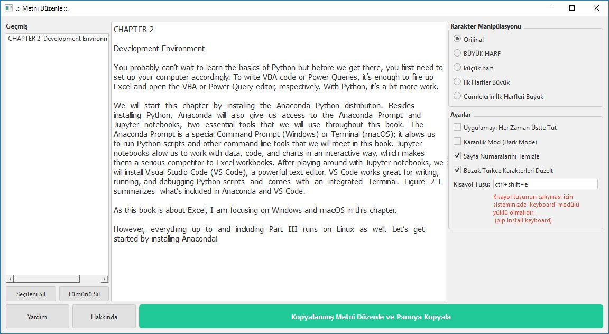

**Karakter Manipülasyonu** Bölümünden, kopyalanıp düzenlenmiş metin için, daha fazla kontrol sağlamış oluyoruz. Örneğin **İlk Harfler Büyük** radyo butonu seçildiğinde, metindeki tüm kelimelerin baş harfleri büyük hale getiriliyor. 

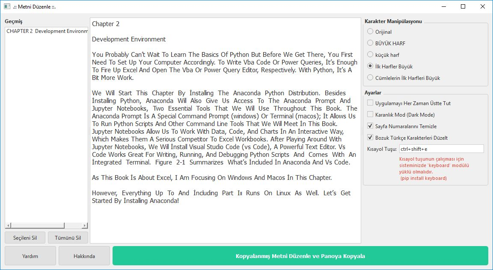

**Karakter Manipülasyonu** Bölümünden, **Orijinale Çevir** butonuna basıldığında metin orjinal haline dönüyor. 

İlave olarak **Ayarlar** bölümünden **Karanlık Mod (Dark Mode)** seçeneğini aktif hale getirelim ve sonucu görelim.;

İkinci bir metin de kopyalanıp düzenlendiğinde, Sol Kısımdaki **Geçmiş** Panelinde 2 metin de görüntüleniyor.

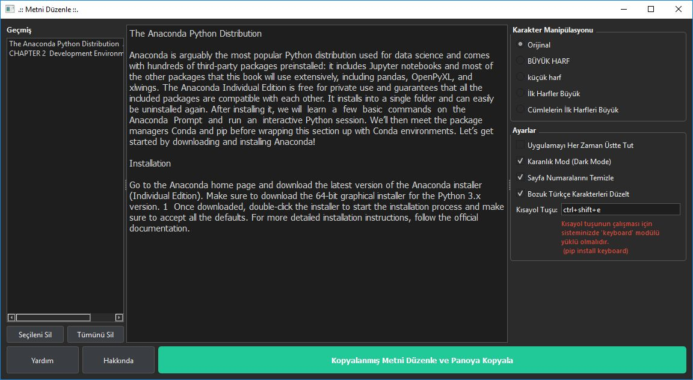

Üçüncü bir metin de kopyalanıp düzenlendiğinde **Geçmiş** Panelinde 3 metin de görüntüleniyor ve seçilebiliyor.

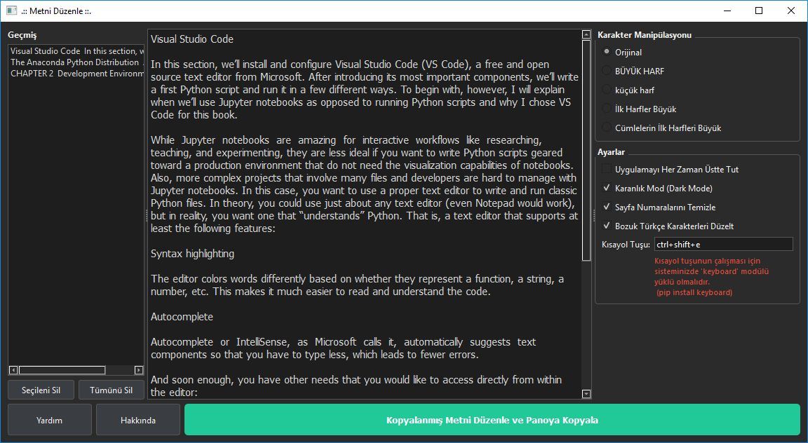

**Geçmiş** Panelinden, silmek bir metni seçelim. 

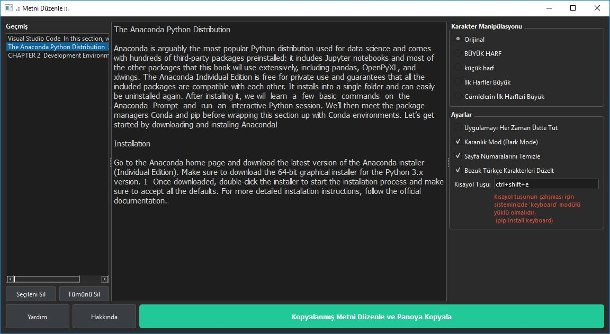

**Geçmiş** Panelinin altındaki **Seçileni Sil** butonuna basarak seçili metni silelim.

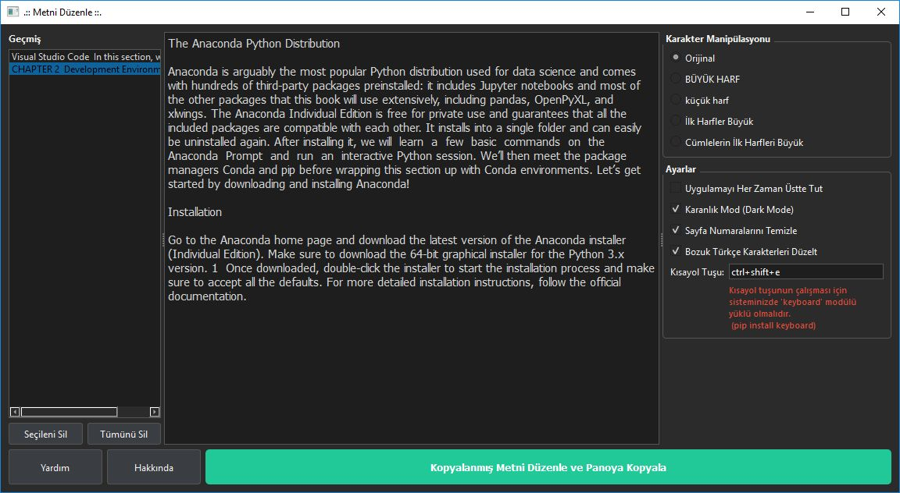

**Geçmiş** Panelinin altındaki **Tümünü Sil** butonuna bastığımızda Onay penceresi açılır.

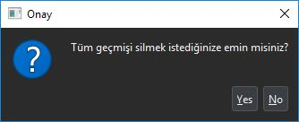

İşlem Onaylandıktan sonra tüm veriler ve içerik temizlenir.

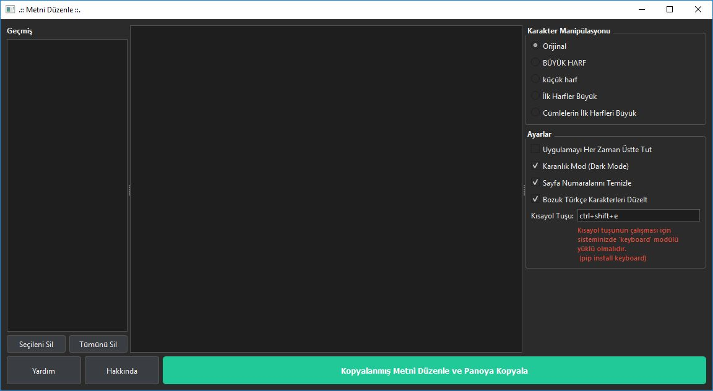

**Yardım Butonu** ile açılan Yardım Penceresinde **Kullanım Rehberi** ve **Ayarlar** konusunda bilgiler sunuluyor.

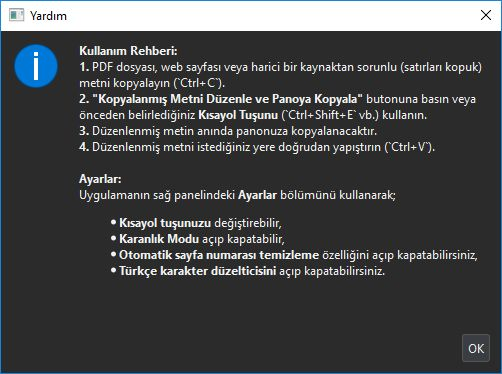

**Hakkında** Penceresinde, Versiyon (sürüm), Geliştirici, Lisans ..vb bilgileri sunuluyor.

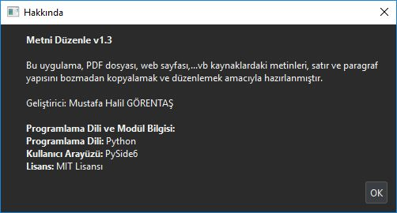

## ℹ️ Geliştirici ve Uygulama Bilgileri

**Geliştirici:** Mustafa Halil GÖRENTAŞ
**Platform:** Google Antigravity
**Metodoloji:** Vibe Coding
**Programlama Dili:** Python
**Arayüz:** PySide6
**Lisans:** [MIT](https://www.ozgurlisanslar.org.tr/mit/)
