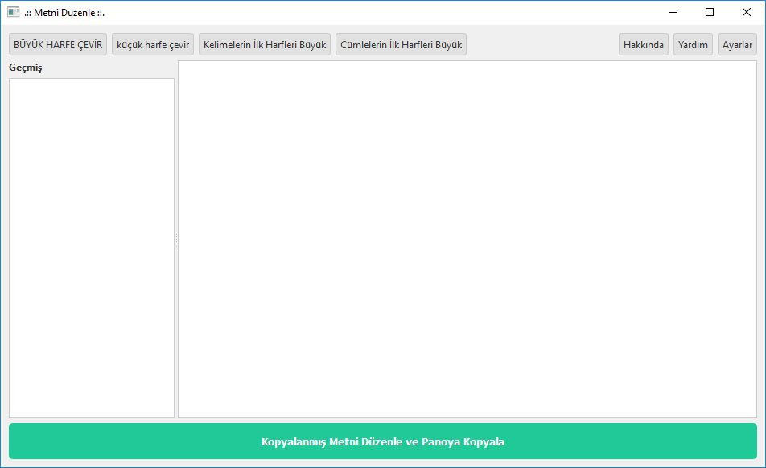
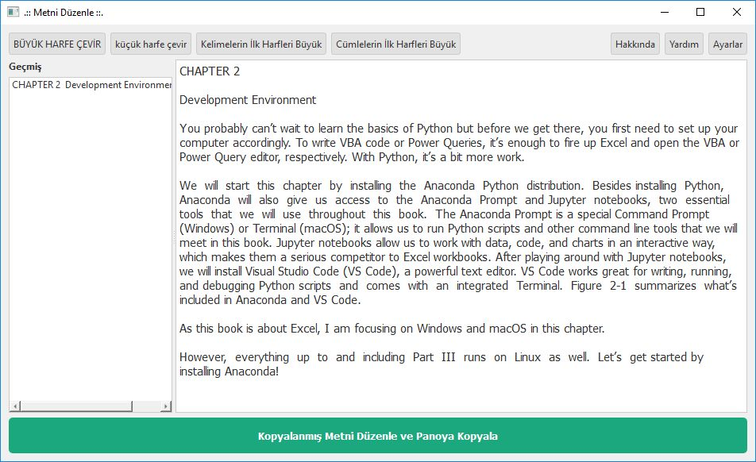
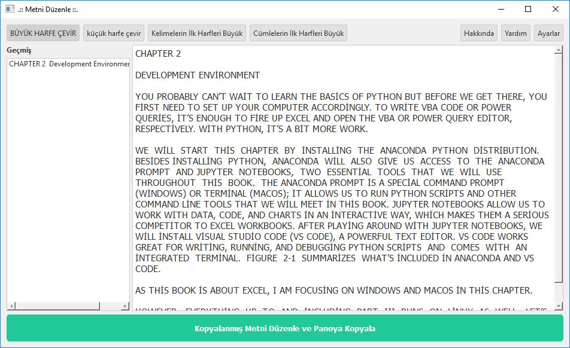
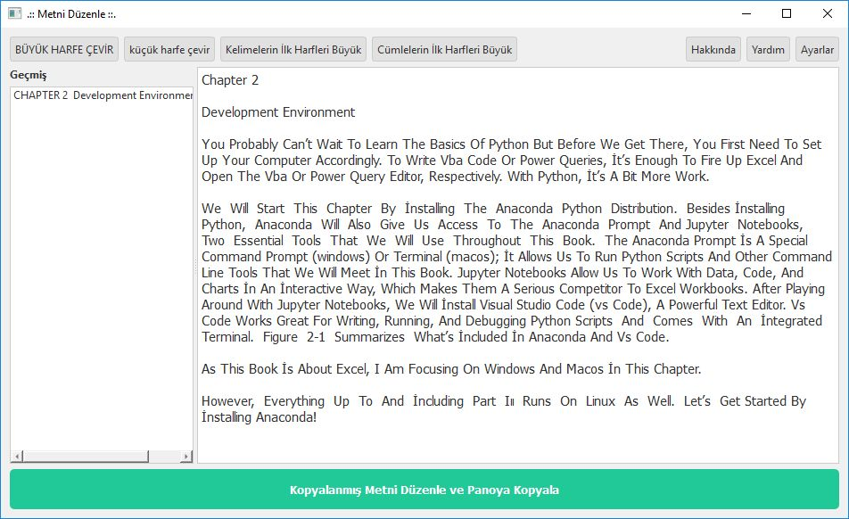
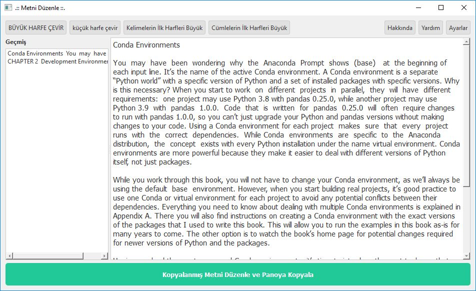
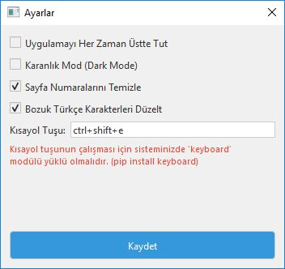
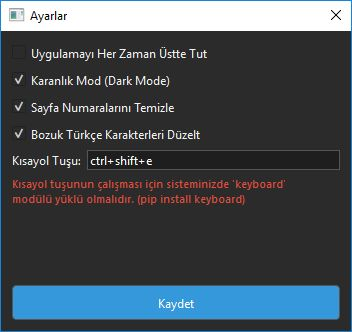
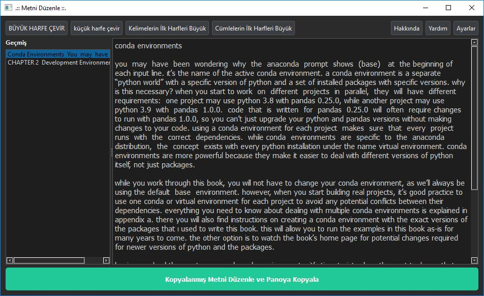
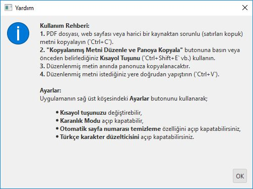
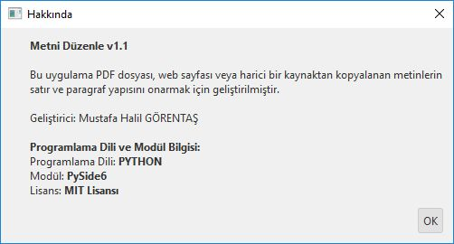

# Metni Düzenle v1.1

**Metni Düzenle**, PDF dosyalarından, web sayfalarından veya çeşitli belgelerden kopyalanan metinlerdeki bozuk satır ve paragraf yapılarını otomatik olarak onaran ve çeviri uygulamalarına (veya metin editörlerine) yapıştırmaya hazır hale getiren akıllı bir masaüstü asistanıdır.

Kopyalanan metinlerin satır aralıklarındaki kopuklukları, hece bölmelerini (tireleri) ve gereksiz satır atlamalarını temizleyerek metnin cümle ve paragraf bütünlüğünü geri kazandırır.

## 🚀 v1.1 Sürüm Özellikleri

* **Akıllı Başlık ve Paragraf Tespiti:** Noktalama işaretiyle bitmese dahi, kısa satırları veya başlıkları otomatik olarak algılar ve kendisinden sonra gelen paragrafla karışmasını engeller.
* **Arka Planda Düzenleme (Kısayol Tuşu):** Uygulama arka planda simge durumundayken bile, kopyaladığınız metni ayarladığınız kısayol tuşuyla (Örn: `Ctrl + Shift + E`) anında düzenleyip panoya geri yapıştırır.
* **Gelişmiş Harf Dönüştürme:** Bazen tümü büyük veya tümü küçük harfle kopyalanan metinleri tek tıkla **BÜYÜK HARFE**, **küçük harfe**, **Kelimelerin İlk Harfleri Büyük** veya **Cümlelerin İlk Harfleri Büyük** formatına dönüştürebilirsiniz.
* **Kusursuz Türkçe Karakter Uyumu:** Dönüştürme işlemleri sırasında Python'un İngilizce standartlarından kaynaklanan `i/I` ve `ı/İ` sorunları tamamen çözülmüştür. Ayrıca PDF kopyalamalarındaki `Ý`, `þ`, `ð` gibi bozuk karakterleri `İ`, `ş`, `ğ` olarak otomatik düzeltir.
* **Sayfa Numarası ve Alt/Üst Bilgi Temizleme:** Kopyalamaya karışan "Sayfa 12" veya sadece sayılardan oluşan gereksiz satırları otomatik temizler.
* **Geçmiş (History) Sekmesi:** Kopyalayıp düzenlediğiniz son metinlere uygulamanın sol panelinden ulaşabilir, kaybolan verilerinizi geri getirebilirsiniz.
* **Karanlık Mod (Dark Mode):** Göz yormayan şık bir arayüz.
* **Her Zaman Üstte:** Uygulama penceresinin okuduğunuz belge kapanıp arkada kalmasını engeller.

## 🛠️ Kurulum Gereksinimleri

Uygulamanın çalışabilmesi için sisteminizde **Python 3** ve aşağıdaki kütüphanelerin yüklü olması gerekmektedir:

```bash
pip install PySide6
pip install keyboard
```

*(Not: Linux ortamında Wayland kullanıyorsanız `keyboard` kütüphanesi kısayol tuşları için ekstra yapılandırma veya `sudo` yetkisi gerektirebilir.)*

## 📖 Kullanım Rehberi

1. Okuduğunuz PDF dosyasından veya web sayfasından sorunlu (satırları kopuk) metni kopyalayın (`Ctrl+C`).
2. Uygulama üzerindeki **"Kopyalanmış Metni Düzenle ve Panoya Kopyala"** butonuna basın veya önceden belirlediğiniz **Kısayol Tuşunu** (`Ctrl+Shift+E` vb.) kullanın.
3. Düzenlenmiş metin anında panonuza alınacaktır.
4. Çeviri sitesine (Google Translate vb.) veya Word dosyanıza doğrudan yapıştırın (`Ctrl+V`). Cümle yapılarının bozulmadığını ve hatasız çevrildiğini göreceksiniz.

## ⚙️ Ayarlar

Uygulamanın sağ üst köşesindeki **Ayarlar** butonunu kullanarak;

* Kısayol tuşunuzu değiştirebilir,
* Karanlık Modu açıp kapatabilir,
* Otomatik sayfa numarası temizleme özelliğini kontrol edebilir,
* Türkçe karakter düzelticisini kapatıp açabilirsiniz.

## 🎨 Uygulama Ekran Görüntüleri

Örnek PDF dosyamız ve kopyalayacağımız sayfa / metin.


Kopyalanan metin, not defterine yapıştırıldığında aşağıdaki sonuç elde ediliyor. PDF dosyasını her satır, ayrı yapı olarak algılanıyor. Bu halde, cümle ve paragraf yapısı bozulmuş oluyor.  


Uygulamanın ilk çalıştırılması ile karşılaşılan görüntü;



**Kopyalanmış Metni Düzenle ve Panoya Kopyala** butonuna basılınca veya önceden belirlediğiniz **Kısayol Tuşuna** (`Ctrl+Shift+E` vb.) basıldığında, kopyalanmış olan metin, kaynaktaki metnin cümle ve paragraf yapısına uygun olacak şekilde düzenleniyor ve uygulama içerisinde görüntüleniyor.

Kopyalanıp düzenlenen metin, sol kısımdaki **Geçmiş** Panelinde görüntülenip seçilebiliyor. 



**Karakter Manipülasyon Butonlarını** kullanarak, kopyalanıp düzenlenmiş metin için, daha fazla kontrol sağlamış oluyoruz. Örneğin **BÜYÜK HARFE ÇEVİR** butonuna basarak tüm harfler büyük hale getirilebiliyor. 



**Kelimelerin İlk Harfleri Büyük** butonuna basıldığında elde edilen sonu.;



İkinci bir metin kopyalanıp düzenlendiğinde Geçmiş Panelinde 2 metin de görüntüleniyor.



**Ayarlar** butonu ile Ayarlar penceresi açılabilir.



**Karanlık Mod** Özelliği Aktif edildi.



Karanlık Moddaki Uygulama görüntüsü;



**Yardım Butonu** ile açılan Yardım Penceresinde Kullanım Rehberi ve Ayarlar konusunda  bilgiler sunuluyor.



Hakkında Penceresinde, Versiyon (sürüm), Geliştirici, ..vb bilgileri sunuluyor.



## ℹ️ Geliştirici ve Uygulama Bilgileri

**Geliştirici:** Mustafa Halil GÖRENTAŞ
**Programlama Dili:** Python
**Arayüz:** PySide6
**Lisans:** MIT
