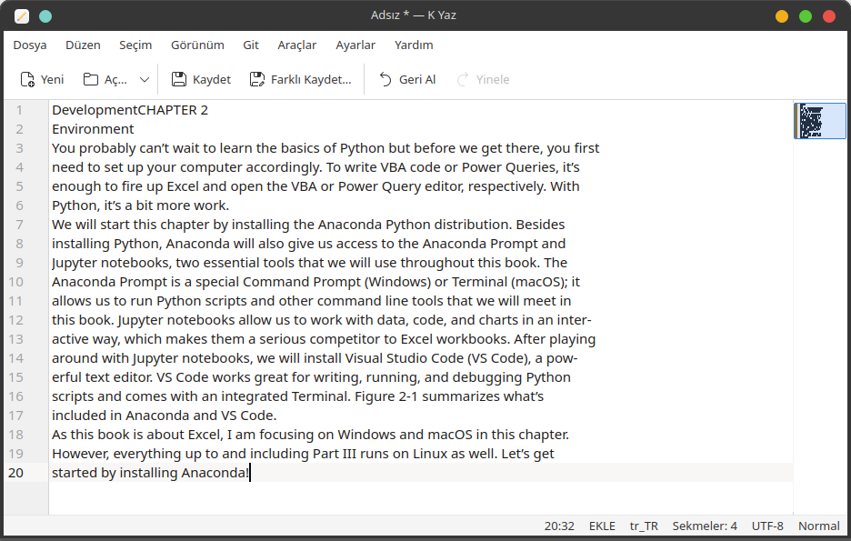
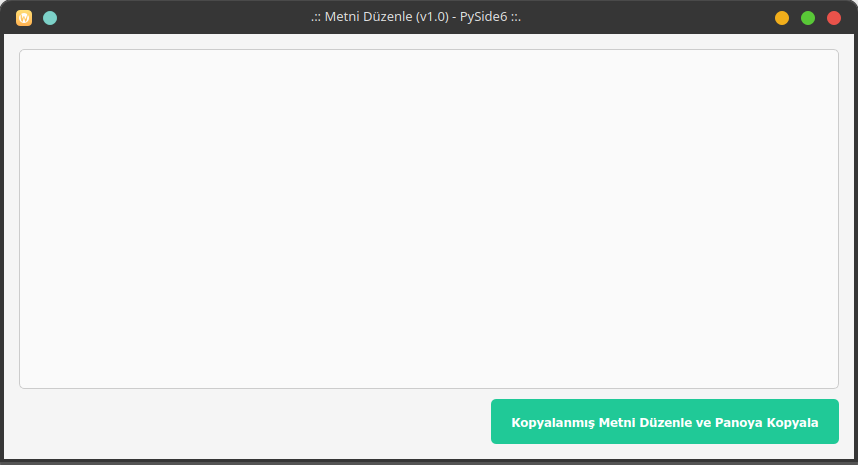
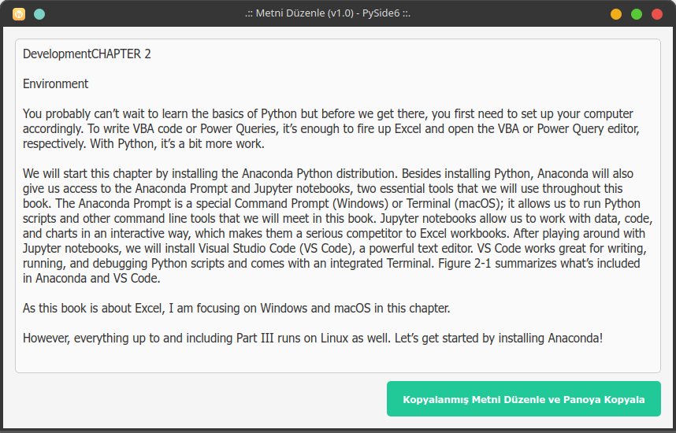
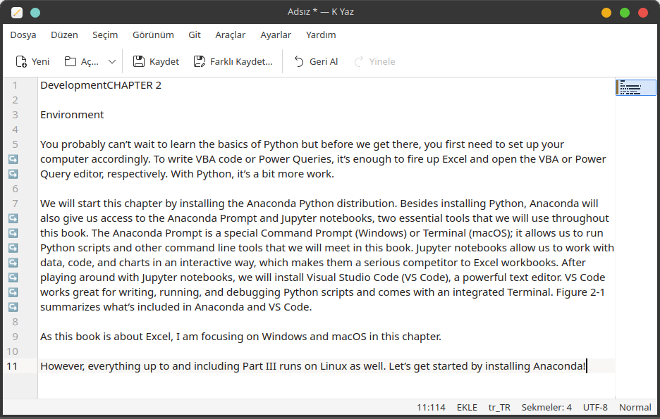

# Metni Düzenle

PDF dosyalarından, web sayfalarından, ...vb kaynaklardan kopyaladığımız metinleri Libre Ofis Writer, Microsoft Word, Gedit, Not Defteri, ...vb metin düzenleme  uygulamalarına yapıştırdığımız zaman, metinlerin satır yapısının, kaynaktan kopyalandığı gibi olduğunu görürüz. 

## v1.0

Aşağıdaki örnek **PDF** dosyası içerisinden istediğiniz metni kopyalayın.

Kopyalanan metin, **KWrite (KYaz) / Not Defteri** uygulaması içerisine yapıştırıldığında karşılaştığımız sonuç aşağıdaki resimlerde görüntülenmektedir. Kopyalanıp yapıştırılan metnin satır yapısı, PDF dosyasındaki içerikle aynı ve aynı, toplam 20 satır veri var.

Metni bu şekilde kopyalayarak Tercüme (translate) uygulamalarına yapıştırırsak, cümle bütünlüğü sağlanmadığı için yanlış tercüme elde ederiz. Bizim yapmak istediğimiz şey, bu içerikteki satırları ardarda getirme, "varsa" bir kısmı alt satıra taşmış kelimeleri birleştirmek ve her bir cümleyi ayrı bir satıra gelecek şekilde düzenlemek.

Uygulama çalıştırıldığında aşağıdaki görüntü ile karşılaşırız.

**Kopyalanmış Metni Düzenle ve Panoya Kopyala** butonuna basıldığında, metin paragraflar halinde düzenlenir ve panoya kopyalanmış yapıştırmaya hazır halde beklemiş olur.

Panoya kopyalanmış olan Düzenlenmiş metni **KWrite (KYaz) / Not Defteri** uygulaması içerisine yapıştırdığımızda aşağıdaki görüntü ile karşılaşırız. Uygulamanın Yatay boyutunu artırsak ta cümle bütünlüğünün korunduğunu görebiliriz çünkü görüldüğü üzere her paragraf bir satır olarak ayarlandı. Metni bu şekilde kopyalayarak Tercüme (translate) uygulamalarına yapıştırısak, cümle bütünlüğü sağlanmış olur.

